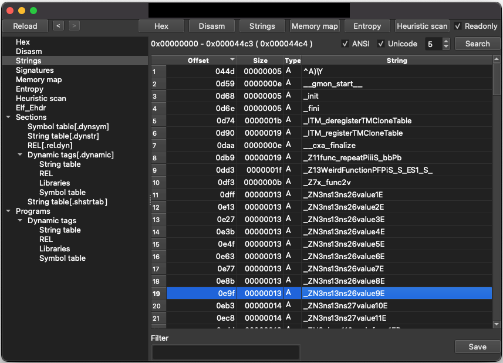
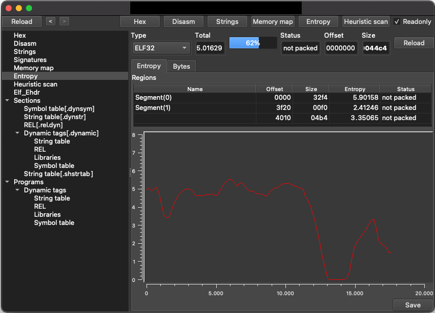
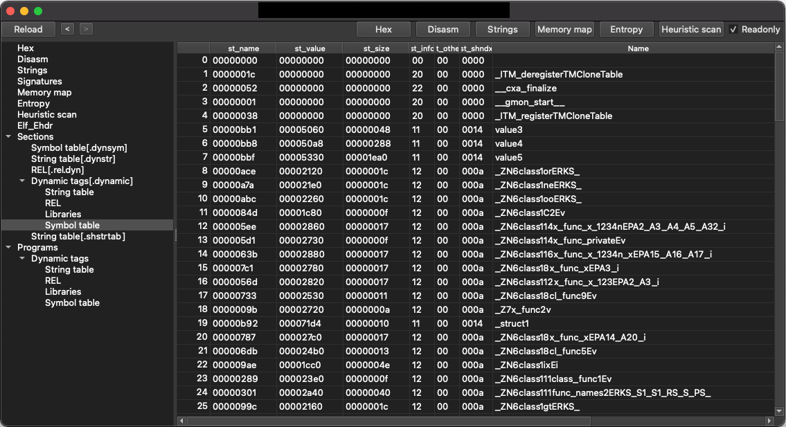
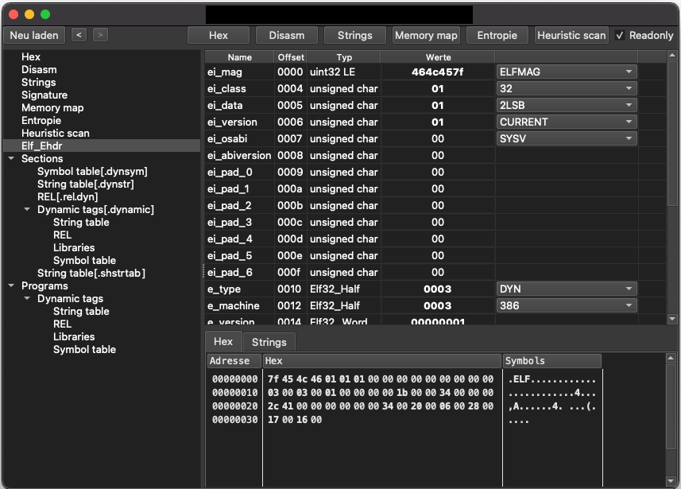
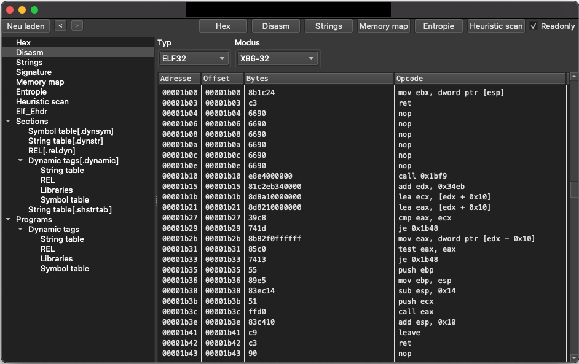

**XELFViewer** - ELF file viewer/editor for Windows, Linux and MacOS.

Changelog: [https://github.com/horsicq/XELFViewer/blob/master/changelog.txt](https://github.com/horsicq/XELFViewer/blob/master/changelog.txt)

More info: [https://github.com/horsicq/XELFViewer](https://github.com/horsicq/XELFViewer)

Download: [https://github.com/horsicq/XELFViewer/releases](https://github.com/horsicq/XELFViewer/releases)

